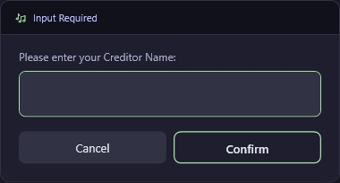
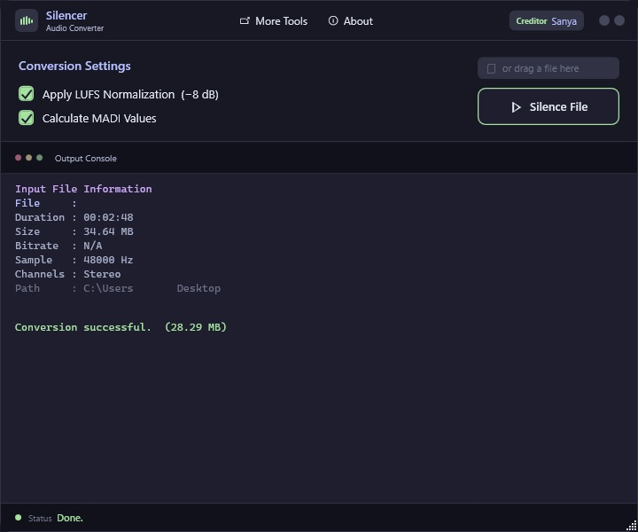
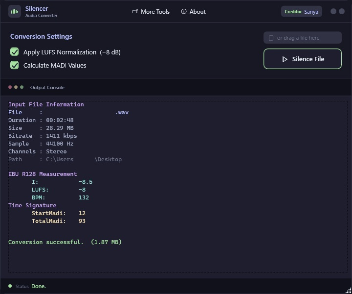

<div align="center">


# Silencer
### Audio Conversion Tool for Audition — v1.5

[](https://github.com/0x53616E/Silencer/releases/download/v1.3.2/Silencer.v1.3.2.exe)
[](https://tinyurl.com/sanyaproject)
[](https://github.com/0x53616E/Silencer)
[](https://dotnet.microsoft.com/en-us/download/dotnet-framework/net48)
[](https://github.com/0x53616E/Silencer)
[](https://www.gyan.dev/ffmpeg/builds/)
[](https://github.com/0x53616E/Silencer/blob/main/LICENSE)

</div>

---

## Table of Contents

- [Installation](#1-installation)
- [Usage](#2-usage)
  - [First Launch](#first-launch)
  - [Converting to WAV](#converting-to-wav)
  - [Converting WAV to OGG](#converting-wav-to-ogg)
  - [Finding Offset, BPM & First Space](#finding-offset-bpm--first-space)
- [Reading the Output](#3-reading-the-output)
- [Requirements](#requirements)

---

## 1. Installation

Download the latest release from one of the following sources:

| Source | Link |
|--------|------|
| **GitHub Releases** | [Silencer.v1.4.exe](https://github.com/0x53616E/Silencer/releases/download/1.4/Silencer.v1.4.exe) |
| **Website** | [tinyurl.com/sanyaproject](https://tinyurl.com/sanyaproject) |

No installation required — just run the `.exe` directly.


---

## 2. Usage

### First Launch

On the very first launch, Silencer will ask you to enter your **Creditor name**. This name will be displayed in the bottom-left corner of the UI for the lifetime of the application.



Once entered, you will see the main interface:


---

### Converting to WAV

Silencer supports the following input formats:

| Format | Action |
|--------|--------|
| `.wav` | Converted directly to `.ogg` |
| `.flac` `.mp3` `.ogg` | **Automatically converted to `.wav` first** |

> **Note:** Silencing (WAV → OGG with MADI values) is only possible from a `.wav` file.  
> All other formats will be converted to `.wav` automatically — simply drag in the new `.wav` afterwards.

**To start a conversion**, either:
- Drag & drop any supported file onto the window, or
- Click the **Silence File** button and select a file



---

### Converting WAV to OGG

Select or drop your `.wav` file. If **Calculate MADI Values** is enabled *(recommended)*, the tool will ask for three values before processing:

#### 1. Manual Offset
The audio offset in seconds (e.g. `-0.078`).


#### 2. BPM
The tempo of the track.


#### 3. First Space Value
The position of the first beat/space.


After confirming all values, Silencer will generate a new `.ogg` file in the **same folder** as your source `.wav`.



---

### Finding Offset, BPM & First Space

All three values can be read directly from **ArrowVortex**:


| Value | Where to find it in ArrowVortex |
|-------|--------------------------------|
| **Offset** | Song offset field (top bar) |
| **BPM** | BPM field (top bar) |
| **First Space** | Beat position of the first measure |

---

## 3. Reading the Output

The output filename follows this pattern:

```
S_<original_name> <BPM> <StartMadi> <TotalMadi>.ogg
```

Example: `S_MySong 128 1 64.ogg`


| Part | Description |
|------|-------------|
| `S_` | Prefix added by Silencer |
| `BPM` | Tempo used during conversion |
| `StartMadi` | Calculated start MADI value |
| `TotalMadi` | Calculated total MADI value |

---

## Requirements

| Requirement | Details |
|-------------|---------|
| **OS** | Windows 10 / 11 |
| **FFmpeg** | Must be on your `C:\` drive **or** in the same folder as `Silencer.exe` |

**Download FFmpeg (Windows):** [gyan.dev/ffmpeg/builds](https://www.gyan.dev/ffmpeg/builds/)

> Silencer will automatically search for `ffmpeg.exe` — no manual path configuration needed.

---

<div align="center">

Copyright © 2026 Sanya. All rights reserved.

</div>
