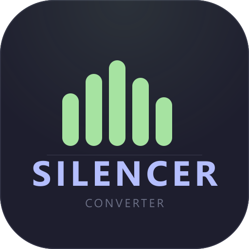
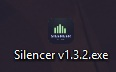
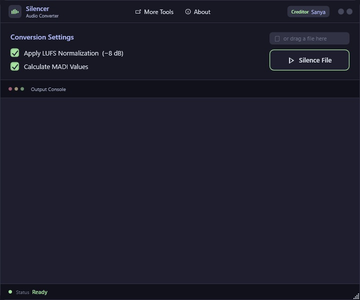
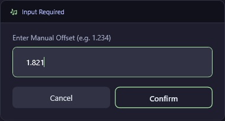
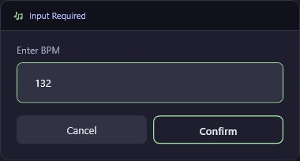
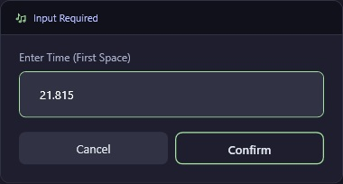
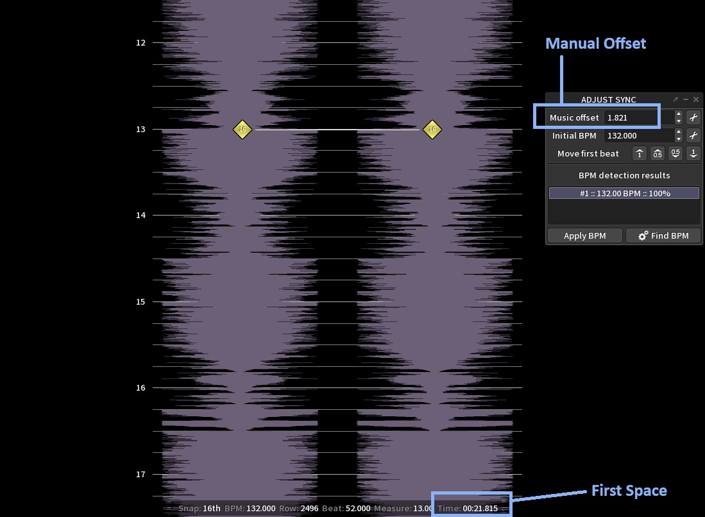
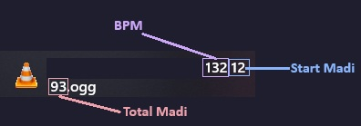

# Silencer
### Audio Conversion Tool for Audition — v1.5 (Midnight Elegance)

---

## Table of Contents

- [Installation](#1-installation)
- [New Features in v1.5](#2-new-features-in-v15)
- [Usage](#3-usage)
  - [Settings Overview](#settings-overview)
  - [Converting to WAV](#converting-to-wav)
  - [Silencing (WAV to OGG/WAV)](#silencing-wav-to-oggwav)
  - [Finding Offset, BPM & First Space](#finding-offset-bpm--first-space)
- [Reading the Output](#4-reading-the-output)
- [Requirements](#requirements)

---

## 1. Installation

Download the latest release from one of the following sources:

| Source | Link |
|--------|------|
| **GitHub Releases** | [Silencer.v1.5.exe](https://github.com/bishpop/SilencerAudition/releases/download/v1.5/Silencer.exe) |
| **Website** | [tinyurl.com/sanyaproject](https://tinyurl.com/sanyaproject) |

No installation required — just run the `.exe` directly. It is now a lightweight, native C++ application!

---

## 2. New Features in v1.5

- **Midnight Elegance Theme:** A completely redesigned, highly responsive ImGui interface.
- **Smart Clipboard:** Automatically reads your clipboard to suggest the Offset value.
- **Auto BPM Detection:** FFmpeg automatically scans the audio to estimate and suggest the BPM.
- **Native C++ Performance:** No longer requires the .NET Framework.
- **LUFS Normalization:** Optionally normalizes your audio to target EBU R128 (-8 LUFS).

---

## 3. Usage

### Settings Overview
Before dropping a file, you can toggle the following settings in the top section:

- **LUFS Normalization:** Automatically adjusts the volume of the song to hit a target of -8 LUFS.
- **Calculate Madi:** Calculates `StartMadi` & `TotalMadi` including the parity rule and automatically trims the audio.
- **WAV Output:** If enabled, outputs a `pcm_s16le` WAV file instead of an OGG file.

---

### Converting to WAV

Silencer supports the following input formats:

| Format | Action |
|--------|--------|
| `.wav` | Triggers the Silencer process (MADI calculation & popups) |
| `.flac` `.mp3` `.ogg` | **Automatically converted to `.wav` first** |

> **Note:** Silencing (calculating MADI values) is only possible from a `.wav` file.  
> If you drag in an MP3, FLAC, or OGG, Silencer will simply convert it to WAV and stop. Afterwards, drag the newly created `.wav` into the tool to silence it.

---

### Silencing (WAV to OGG/WAV)

Drag & drop your `.wav` file into the drop zone. If **Calculate Madi** is enabled, the tool will ask for three values via popups:

#### 1. Manual Offset
The audio offset in seconds (e.g. `-0.078`). 
*Pro Tip: If you copy the offset to your clipboard before dropping the file, Silencer will automatically fill it in for you!*

#### 2. BPM
The tempo of the track. Silencer runs a quick background scan and suggests the detected BPM automatically.

#### 3. First Space Value
The position of the first beat/space in the timeline.

After confirming all values, Silencer will process the file, update the beautiful metric cards, and generate the final file in the **same folder** as your source `.wav`. You can track everything in the large bottom **Log Area**.

---

### Finding Offset, BPM & First Space

If you need to find the values manually, you can read them directly from **ArrowVortex**:

| Value | Where to find it in ArrowVortex |
|-------|--------------------------------|
| **Offset** | Song offset field (top bar) |
| **BPM** | BPM field (top bar) |
| **First Space** | Beat position of the first measure |

---

## 4. Reading the Output

If **Calculate Madi** is enabled, the output filename follows this pattern:
*(File extension will be `.wav` if the WAV Output toggle is active).*

Example: `S_MySong 128 1 64.ogg`

| Part | Description |
|------|-------------|
| `S_` | Prefix added by Silencer |
| `BPM` | Tempo used during conversion |
| `StartMadi` | Calculated start MADI value |
| `TotalMadi` | Calculated total MADI value |

---

## Requirements

| Requirement | Details |
|-------------|---------|
| **OS** | Windows 10 / 11 |
| **FFmpeg** | Requires `ffmpeg.exe` and `ffprobe.exe` |

**Download FFmpeg (Windows):** [gyan.dev/ffmpeg/builds](https://www.gyan.dev/ffmpeg/builds/)

> **Note:** Silencer will automatically search for `ffmpeg.exe` and `ffprobe.exe`. You can place them directly next to `Silencer.exe`, in your System `PATH`, or in common folders like `C:\ffmpeg\bin`.

---

Copyright © 2026 Sanya. All rights reserved.

